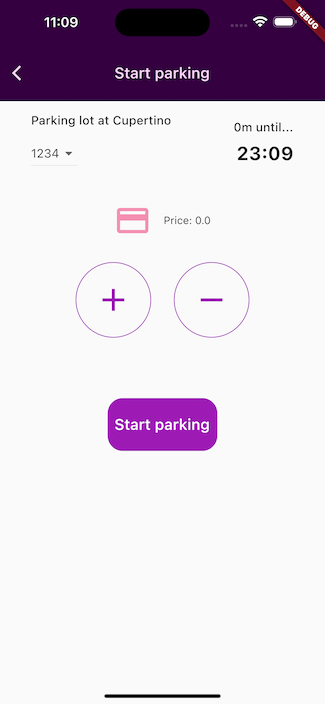

# Flutter Parking - Educational Pet Project

Flutter Parking is not intented to be used commercially, is just a Pet Project for me to exercise real world needs of a Mobile Solution with Flutter.
Idea is to share the experiences and decisions taken in form of posts, as long as I advance in many other mobile topics in this Pet Project.

## Screenshots

 

 

## What has been covered so far

(Will be updated accordingly with the topics I explore)

- Riverpod and Flutter project architecture
- Github Actions running tests and creating code coverage report, using Codecov
- Firebase Authentication with Google login
- Firebase Remote Database for backend
- Theming and styles with dark/light mode support
- Consuming Google Places API to plot the markes in the map
- ...

## Riverpod

Riverpod as per the official page describes, is "A Reactive Caching and Data-binding Framework". One option of many state management in the Flutter world, you can check the highlighted options here https://docs.flutter.dev/data-and-backend/state-mgmt/options

... 
